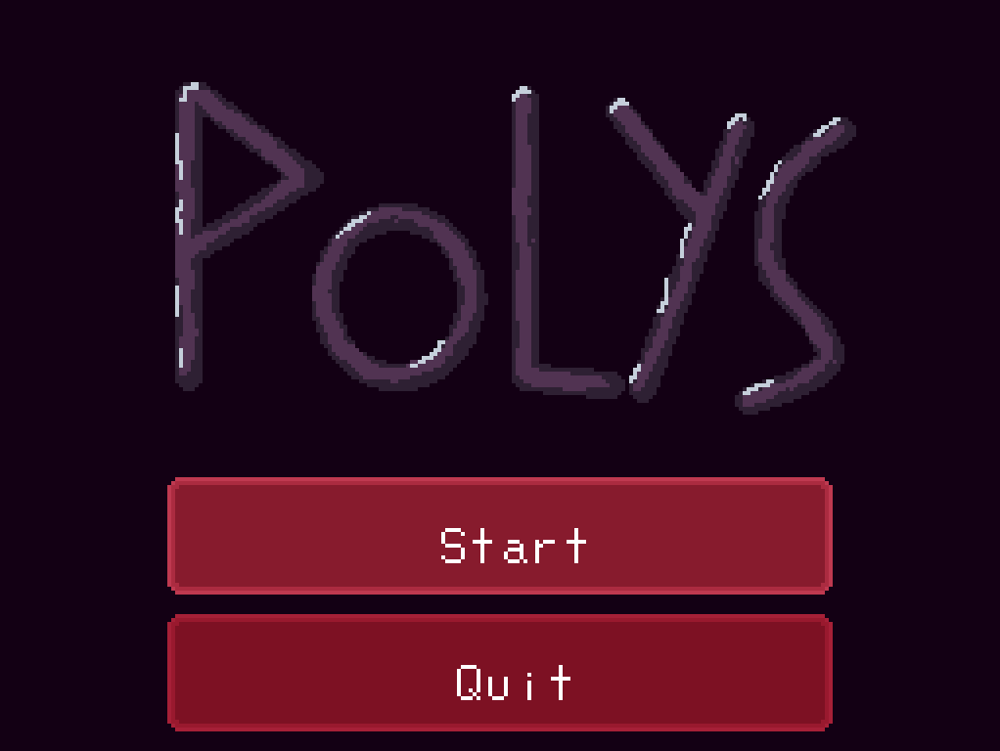
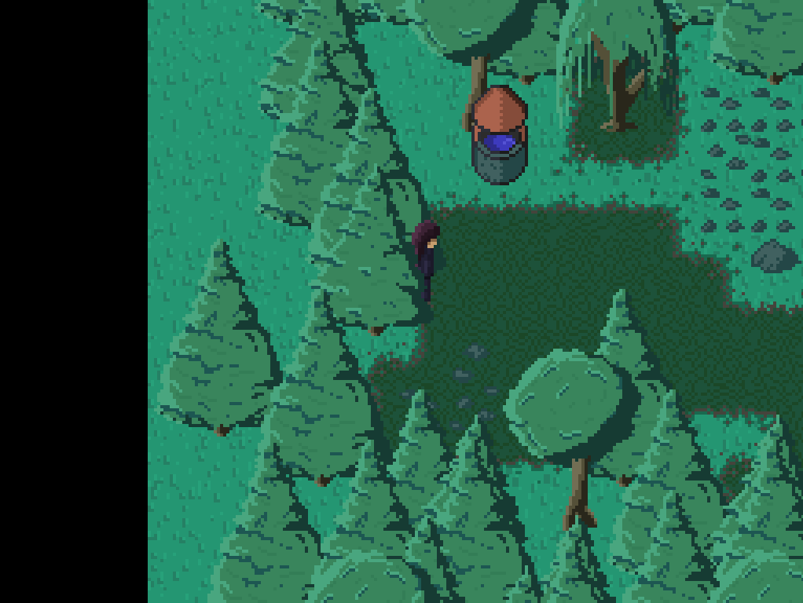

# Polys

Polys is a 2D game engine that is basically my attempt to have an old school 2D game made ^_^ It is not as ambition as my 3D games, which will likely never be finished, but yet it is not trivial - it uses the LUA scripting language, Tiled tilesets, a state system, post-processing effects, and more. I personally like to think of it not as a simpler project, but one that is different and more easily endable!

